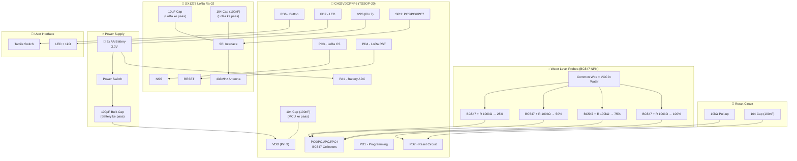

# 🔧 PCB Design Package — CH32V003F4P6 Tank Sensor

Battery-powered wireless water level sensor using CH32V003F4P6 MCU with SX1278 LoRa (433 MHz).
Reads 4 water level probes (via BC547 NPN transistors), monitors battery voltage, and transmits data wirelessly.

---

## ⚡ Power Source: 2x AA Batteries (3.0V)

---

## Complete Pin Mapping (CH32V003F4P6 — TSSOP-20)

| TSSOP-20 Pin | Pin Name | Function | Connection | Direction | Notes |
|:---:|:---:|:---:|:---:|:---:|:---|
| 1 | PD4 | GPIO Out | **LoRa RST** | Output | Reset pin for SX1278 Ra-02 |
| 2 | PD5 | USART TX | **Debug UART TX** | Output | Optional — remove for production |
| 3 | PD6 | GPIO In | **Push Button** | Input (Pull-up) | Active LOW, EXTI wake from sleep |
| 4 | PD7 | NRST | **Reset Circuit** | Input | 10kΩ pull-up + 104 (100nF) cap |
| 5 | PA1 | ADC Ch1 | **Battery Voltage ADC** | Analog In | Via 100kΩ/100kΩ divider |
| 6 | PA2 | GPIO | **NC** (Reserved) | — | Spare — test pad optional |
| 7 | VSS | GND | **Ground** | Power | Connect to ground plane |
| 8 | PD0 | GPIO | **NC** (Available) | — | Spare GPIO |
| 9 | VDD | VCC | **3.3V Power** | Power | 104 (100nF) decoupling cap |
| 10 | PC0 | GPIO In | **Water Sensor 25%** | Input (Pull-up) | Via BC547 NPN collector |
| 11 | PC1 | GPIO In | **Water Sensor 50%** | Input (Pull-up) | Via BC547 NPN collector |
| 12 | PC2 | GPIO In | **Water Sensor 75%** | Input (Pull-up) | Via BC547 NPN collector |
| 13 | PC3 | GPIO Out | **LoRa NSS (CS)** | Output | SPI Chip Select for SX1278 |
| 14 | PC4 | GPIO In | **Water Sensor 100%** | Input (Pull-up) | Via BC547 NPN collector |
| 15 | PC5 | SPI1_SCK | **LoRa SCK** | AF Output | SPI Clock |
| 16 | PC6 | SPI1_MOSI | **LoRa MOSI** | AF Output | SPI Master Out |
| 17 | PC7 | SPI1_MISO | **LoRa MISO** | Input (Pull-up) | SPI Master In |
| 18 | PD1 | SWIO | **Programming (SWD)** | Bidirectional | Single-wire debug — test pad |
| 19 | PD2 | GPIO Out | **Status LED** | Output | Via 1kΩ resistor to LED |
| 20 | PD3 | GPIO | **NC** (Available) | — | Spare GPIO |

---

## Block Diagram



---

## Capacitor Placement — Summary

| # | Location | Capacitor | Value | Qty | Purpose |
|:---:|:---|:---|:---|:---:|:---|
| 1 | **Battery ke paas** | Electrolytic | **100µF** | 1 | Main energy reservoir — poore board ka bulk tank |
| 2 | **LoRa Ra-02 VCC/GND** | Ceramic | **10µF** | 1 | LoRa TX local bulk — 120mA+ current spikes handle |
| 3 | **LoRa Ra-02 VCC/GND** | Ceramic | **104 (100nF)** | 1 | LoRa SPI high-frequency noise filter |
| 4 | **MCU VDD/GND** | Ceramic | **104 (100nF)** | 1 | MCU decoupling — switching noise clean |
| 5 | **NRST to GND** | Ceramic | **104 (100nF)** | 1 | Clean power-on reset |

> [!IMPORTANT]
> **Total: 5 capacitors** → 1× 100µF (electrolytic), 1× 10µF (ceramic), 3× 104/100nF (ceramic)
>
> **Logic:** Bada consumer (LoRa) = zyada capacitance uske paas. Battery = sabse badi bulk cap. MCU = sirf 104 kaafi hai.

---

## Bill of Materials (BOM) — Complete

| # | Ref | Component | Value/Part | Package | Qty | Notes |
|:---:|:---:|:---|:---|:---|:---:|:---|
| 1 | U1 | MCU | CH32V003F4P6 | TSSOP-20 | 1 | Main microcontroller |
| 2 | U2 | LoRa Module | SX1278 Ra-02 (Ai-Thinker) | Module | 1 | 433 MHz, includes antenna matching |
| 3 | Q1 | NPN Transistor | BC547 | TO-92 | 1 | Probe 25% buffer |
| 4 | Q2 | NPN Transistor | BC547 | TO-92 | 1 | Probe 50% buffer |
| 5 | Q3 | NPN Transistor | BC547 | TO-92 | 1 | Probe 75% buffer |
| 6 | Q4 | NPN Transistor | BC547 | TO-92 | 1 | Probe 100% buffer |
| 7 | C1 | Bulk Capacitor | **100µF** electrolytic | Through-hole | 1 | **Battery ke paas** |
| 8 | C2 | Bulk Capacitor | **10µF** ceramic | 0805 / TH | 1 | **LoRa Ra-02 ke paas** |
| 9 | C3 | Decoupling Cap | **104 (100nF)** ceramic | 0603 | 1 | **LoRa Ra-02 ke paas** |
| 10 | C4 | Decoupling Cap | **104 (100nF)** ceramic | 0603 | 1 | **MCU VDD/GND ke paas** |
| 11 | C5 | Reset Cap | **104 (100nF)** ceramic | 0603 | 1 | **NRST to GND** |
| 12 | R1 | Battery Divider High | 100kΩ | 0603 | 1 | Battery+ to PA1 |
| 13 | R2 | Battery Divider Low | 100kΩ | 0603 | 1 | PA1 to GND |
| 14 | R3 | Reset Pull-up | 10kΩ | 0603 | 1 | NRST to VDD |
| 15 | R4 | LED Resistor | 1kΩ | 0603 | 1 | PD2 to LED anode |
| 16 | R5 | Probe Base Resistor | 100kΩ | 0603 | 1 | Q1 base (25%) |
| 17 | R6 | Probe Base Resistor | 100kΩ | 0603 | 1 | Q2 base (50%) |
| 18 | R7 | Probe Base Resistor | 100kΩ | 0603 | 1 | Q3 base (75%) |
| 19 | R8 | Probe Base Resistor | 100kΩ | 0603 | 1 | Q4 base (100%) |
| 20 | D1 | Status LED | Green LED | 0603/0805 | 1 | Status indicator |
| 21 | SW1 | Push Button | Tactile switch 6mm | SMD/TH | 1 | PD6, active LOW |
| 22 | SW2 | Power Switch | SPST slide switch | Through-hole | 1 | Battery disconnect |
| 23 | J1 | Battery Holder | 2x AA holder | Through-hole | 1 | 3.0V (2 × 1.5V) |
| 24 | J2 | Programming Header | 1×3 pin header | 2.54mm | 1 | VCC, SWIO (PD1), GND |
| 25 | J3 | Sensor Connector | 1×5 pin header | 2.54mm | 1 | 4 probes + Common (VCC) |
| 26 | J4 | Debug UART (Optional) | 1×2 pin header | 2.54mm | 1 | PD5 TX + GND |
| 27 | ANT1 | Antenna | Spring / IPEX | — | 1 | 433 MHz — comes with Ra-02 |

---

## Detailed Schematic — All Sections

### Section 1: Power Supply

```
                       SW2 (Power Switch)
2x AA Battery (+) ─────┤ ON/OFF ├─────┬──── VDD (3.0V Power Rail)
   (3.0V)                              │
                                       │
                                  C1 (100µF) ── GND
                                  ← Battery ke BILKUL paas!
                                  ← Main energy reservoir

2x AA Battery (-) ──────────────────── GND
```

**Then VDD rail goes to:**
```
VDD Rail ──┬── MCU VDD (Pin 9) ──┬── C4 (104/100nF) ── GND   ← MCU ke 3mm ke andar
            │                     │
            │                     └── (MCU power clean)
            │
            └── LoRa Ra-02 VCC ──┬── C2 (10µF) ── GND        ← LoRa ke paas, TX bulk
                                  │
                                  └── C3 (104/100nF) ── GND    ← LoRa ke paas, SPI noise
```

> [!IMPORTANT]
> **Capacitor chain logic:**
> - 100µF (battery) → poore board ka energy tank
> - 10µF (LoRa) → LoRa TX ke 120mA+ spikes local handle
> - 104/100nF (LoRa) → SPI high-frequency noise clean
> - 104/100nF (MCU) → MCU switching noise clean
> - 104/100nF (NRST) → Clean power-on reset

---

### Section 2: Reset Circuit

```
        VDD (3.0V)
            │
        ┌───┴───┐
        │R3=10kΩ│   ← NRST ko hamesha HIGH rakhta hai
        └───┬───┘
            │
            ├────────── NRST (Pin 4 / PD7)  ← MCU Reset Pin
            │
        ┌───┴───┐
        │C5=104 │   ← Power-on pe briefly LOW → Clean Reset
        │(100nF)│
        └───┬───┘
            │
           GND
```

**Kaise kaam karta hai:**
- Board ON → C5 discharged → NRST LOW → MCU Reset
- R3 se C5 charge hota hai → NRST HIGH → MCU start
- Normal mein R3 NRST ko HIGH rakhta hai → stable operation
- Noise se random reset nahi hoga

---

### Section 3: SPI1 → LoRa Ra-02 Module

```
MCU                              Ra-02 LoRa Module
─────                            ──────────────────
PC5 (Pin 15) ── SPI1_SCK  ────→  SCK
PC6 (Pin 16) ── SPI1_MOSI ────→  MOSI
PC7 (Pin 17) ── SPI1_MISO ←────  MISO
PC3 (Pin 13) ── NSS/CS    ────→  NSS
PD4 (Pin 1)  ── RST       ────→  RST

                                  VCC ── 3.0V (VDD)
                                   ├── C2 (10µF) ── GND     ← TX bulk cap
                                   ├── C3 (104/100nF) ── GND ← Noise filter
                                  GND ── GND
                                  ANT ── 433MHz Antenna (IPEX)
```

> [!CAUTION]
> Ra-02 module **sirf 3.3V max** pe chalega! 2x AA = 3.0V toh direct connection safe hai.

---

### Section 4: Water Level Probes — BC547 NPN Circuit

**Common Wire = VCC paani mein 💧**

**Har probe ka circuit (4x same circuit):**

```
VCC (3.0V) ─── Common Wire ─── [PAANI MEIN 💧]
                                       │
                                 (Water Resistance)
                                       │
                                  Probe Wire (25% / 50% / 75% / 100%)
                                       │
                                 ┌─────┴─────┐
                                 │R5-R8=100kΩ│  ← Base current limiter
                                 └─────┬─────┘
                                       │
                                    Base (B)
                                       │
                              ┌────────┼────────┐
                              │    BC547 NPN     │
                              │                  │
                         Collector (C)      Emitter (E)
                              │                  │
                         MCU Pin              GND
                    (PC0/PC1/PC2/PC4)
                              │
                     [Internal Pull-up VCC]
```

**Probe connections table:**

| Probe Level | Probe Wire | Base Resistor | Transistor | Collector → MCU Pin |
|:---:|:---|:---:|:---:|:---:|
| 25% | Probe at 25% mark | R5 (100kΩ) | Q1 (BC547) | PC0 (Pin 10) |
| 50% | Probe at 50% mark | R6 (100kΩ) | Q2 (BC547) | PC1 (Pin 11) |
| 75% | Probe at 75% mark | R7 (100kΩ) | Q3 (BC547) | PC2 (Pin 12) |
| 100% | Probe at 100% mark | R8 (100kΩ) | Q4 (BC547) | PC4 (Pin 14) |
| Common | VCC wire in water | — | — | VCC (3.0V) |

**Sensing Logic (firmware compatible — no code change):**

| Water Level | BC547 State | MCU Pin | Firmware Reads |
|:---|:---:|:---:|:---:|
| No Water | OFF | HIGH (pull-up) | `1` |
| Water Detected | ON | LOW | `0` ✅ |

---

### Section 5: Battery Monitoring (Voltage Divider)

```
Battery (+) ── R1 (100kΩ) ──┬── PA1 (Pin 5) ADC Input
                              │
                         R2 (100kΩ)
                              │
                             GND
```

Divides battery voltage by 2: 3.0V → 1.5V at ADC pin.

---

### Section 6: LED Circuit

```
PD2 (Pin 19) ── R4 (1kΩ) ──→ LED Anode (+) ── LED Cathode (-) ── GND
```

Active HIGH: PD2 = HIGH → LED ON, PD2 = LOW → LED OFF.

---

### Section 7: Button Circuit

```
PD6 (Pin 3) ──┬── SW1 (Tactile Switch) ── GND
               │
        (Internal Pull-Up — software enabled)
```

Active LOW: Button pressed → PD6 = LOW → Interrupt triggers.

---

### Section 8: Programming Interface (SWD)

```
J2 Header (1×3, 2.54mm):
  ┌─────────────────┐
  │ Pin 1: VCC      │ ── 3.0V
  │ Pin 2: SWIO     │ ── PD1 (Pin 18) — Single-wire debug
  │ Pin 3: GND      │ ── GND
  └─────────────────┘
```

---

### Section 9: Debug UART (Optional)

```
J4 Header (1×2, 2.54mm):
  ┌─────────────────┐
  │ Pin 1: TX       │ ── PD5 (Pin 2) — USART1 TX
  │ Pin 2: GND      │ ── GND
  └─────────────────┘
```

---

## PCB Layout Guidelines

### Board Specifications

| Parameter | Value |
|:---|:---|
| **Board Size** | ~40mm × 55mm |
| **Layers** | 2-layer PCB |
| **Copper** | 1 oz (35µm) |
| **Signal Traces** | 0.25mm (10 mil) |
| **Power Traces** | 0.5mm (20 mil) |
| **Board Thickness** | 1.6mm |

### Component Placement (Top View)

```
┌──────────────────────────────────────────────┐
│  [J2 Programming]              [ANT1 IPEX]   │
│   VCC SWIO GND                                │
│                                               │
│   ┌──────────────────────────┐                │
│   │                          │                │
│   │    Ra-02 LoRa Module     │  ← Board edge  │
│   │    (SX1278 433MHz)       │    antenna ke   │
│   │                          │    liye         │
│   └──────────────────────────┘                │
│        C2(10µF)  C3(104)                      │
│                                               │
│       C4(104) ┌──────────┐                    │
│        R3 ────┤CH32V003  ├                    │
│       C5(104)─┤ F4P6     ├                    │
│               └──────────┘                    │
│                                               │
│  [D1 LED]  [R4]  [SW1 Button]                │
│                                               │
│  Q1──R5  Q2──R6  Q3──R7  Q4──R8             │
│  (BC547 NPN Transistors + Base Resistors)     │
│                                               │
│  R1 ── R2 (Battery Voltage Divider)          │
│                                               │
│  [J3 Sensor 5-pin]          [J1 2xAA Holder] │
│                         C1(100µF)             │
│  [J4 Debug UART]            [SW2 Power]       │
└──────────────────────────────────────────────┘
```

### Critical Layout Rules

> [!IMPORTANT]
> 1. **C1 (100µF)** — Battery holder ke bilkul paas lagao (main bulk tank)
> 2. **C2 (10µF) + C3 (104)** — LoRa Ra-02 VCC/GND pins ke 3mm ke andar
> 3. **C4 (104)** — MCU VDD (Pin 9) aur VSS (Pin 7) ke 3mm ke andar
> 4. **C5 (104)** — NRST (Pin 4) ke paas
> 5. **Ground plane** — Bottom layer pe solid copper pour (GND)
> 6. **LoRa module** — Board edge pe, antenna ke neeche ground plane MAT rakhna
> 7. **BC547 transistors** — Sensor connector (J3) ke paas group karo
> 8. **Battery divider (R1, R2)** — Digital traces se door (noise avoid)

---

## Connector Pinout Summary

### J3 — Sensor Connector (1×5)

| Pin | Signal | Wire Color (Suggest) |
|:---:|:---|:---|
| 1 | Probe 25% (→ Q1 Base via R5) | White |
| 2 | Probe 50% (→ Q2 Base via R6) | Yellow |
| 3 | Probe 75% (→ Q3 Base via R7) | Orange |
| 4 | Probe 100% (→ Q4 Base via R8) | Red |
| 5 | Common (VCC — goes in water) | Blue |

---

## Verification Plan

### Before Ordering PCB
- [ ] KiCad DRC (Design Rule Check) — 0 errors
- [ ] KiCad ERC (Electrical Rule Check) — 0 errors
- [ ] Pin connections match [config.h](file:///c:/Users/shaik/mounriver-studio-projects/CH32V003F4P6_tank_sensor/User/config.h)
- [ ] Ra-02 footprint matches actual module dimensions
- [ ] 2x AA battery holder footprint correct
- [ ] BC547 pinout correct (E-B-C for TO-92)
- [ ] All 5 capacitors placed at correct locations

### After PCB Arrives
- [ ] Visual inspection + multimeter continuity
- [ ] Solder MCU → test SWD programming (J2)
- [ ] Solder LoRa module → test SPI communication
- [ ] Solder BC547s → test water detection with each probe
- [ ] Test battery monitoring ADC
- [ ] Full system test — power on, pair, transmit
