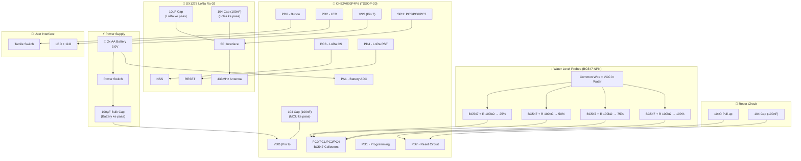

# 🔧 PCB Design Package — CH32V003F4P6 Tank Sensor

Battery-powered wireless water level sensor using CH32V003F4P6 MCU with SX1278 LoRa (433 MHz).
Reads 4 water level probes (via BC547 NPN transistors), monitors battery voltage, and transmits data wirelessly.

---

## ⚡ Power Source: 2x AA Batteries (3.0V)

---

## Complete Pin Mapping (CH32V003F4P6 — TSSOP-20)

| TSSOP-20 Pin | Pin Name | Function | Connection | Direction | Notes |
|:---:|:---:|:---:|:---:|:---:|:---|
| 1 | PD4 | GPIO Out | **LoRa RST** | Output | Reset pin for SX1278 Ra-02 |
| 2 | PD5 | USART TX | **Debug UART TX** | Output | Optional — remove for production |
| 3 | PD6 | GPIO In | **Push Button** | Input (Pull-up) | Active LOW, EXTI wake from sleep |
| 4 | PD7 | NRST | **Reset Circuit** | Input | 10kΩ pull-up + 104 (100nF) cap |
| 5 | PA1 | GPIO / ADC | **NC** (Spare) | — | Battery monitoring uses internal 1.20V Vref (0µA drain) |
| 6 | PA2 | GPIO | **NC** (Reserved) | — | Spare — test pad optional |
| 7 | VSS | GND | **Ground** | Power | Connect to ground plane |
| 8 | PD0 | GPIO | **NC** (Available) | — | Spare GPIO |
| 9 | VDD | VCC | **3.3V Power** | Power | 104 (100nF) decoupling cap |
| 10 | PC0 | GPIO In | **Water Sensor 25%** | Input (Pull-up) | Via BC547 NPN collector |
| 11 | PC1 | GPIO In | **Water Sensor 50%** | Input (Pull-up) | Via BC547 NPN collector |
| 12 | PC2 | GPIO In | **Water Sensor 75%** | Input (Pull-up) | Via BC547 NPN collector |
| 13 | PC3 | GPIO Out | **LoRa NSS (CS)** | Output | SPI Chip Select for SX1278 |
| 14 | PC4 | GPIO In | **Water Sensor 100%** | Input (Pull-up) | Via BC547 NPN collector |
| 15 | PC5 | SPI1_SCK | **LoRa SCK** | AF Output | SPI Clock |
| 16 | PC6 | SPI1_MOSI | **LoRa MOSI** | AF Output | SPI Master Out |
| 17 | PC7 | SPI1_MISO | **LoRa MISO** | Input (Pull-up) | SPI Master In |
| 18 | PD1 | SWIO | **Programming (SWD)** | Bidirectional | Single-wire debug — test pad |
| 19 | PD2 | GPIO Out | **Status LED** | Output | Via 1kΩ resistor to LED |
| 20 | PD3 | GPIO Out | **Sensor Power Pin** | Output | Pulsed 2ms common wire drive (zero-corrosion) |

---

## Block Diagram



---

## Capacitor Placement — Summary

| # | Location | Capacitor | Value | Qty | Purpose |
|:---:|:---|:---|:---|:---:|:---|
| 1 | **Battery ke paas** | Electrolytic | **100µF** | 1 | Main energy reservoir — poore board ka bulk tank |
| 2 | **LoRa Ra-02 VCC/GND** | Ceramic | **10µF** | 1 | LoRa TX local bulk — 120mA+ current spikes handle |
| 3 | **LoRa Ra-02 VCC/GND** | Ceramic | **104 (100nF)** | 1 | LoRa SPI high-frequency noise filter |
| 4 | **MCU VDD/GND** | Ceramic | **104 (100nF)** | 1 | MCU decoupling — switching noise clean |
| 5 | **NRST to GND** | Ceramic | **104 (100nF)** | 1 | Clean power-on reset |

> [!IMPORTANT]
> **Total: 5 capacitors** → 1× 100µF (electrolytic), 1× 10µF (ceramic), 3× 104/100nF (ceramic)
>
> **Logic:** Bada consumer (LoRa) = zyada capacitance uske paas. Battery = sabse badi bulk cap. MCU = sirf 104 kaafi hai.

---

## Bill of Materials (BOM) — Complete

| # | Ref | Component | Value/Part | Package | Qty | Notes |
|:---:|:---:|:---|:---|:---|:---:|:---|
| 1 | U1 | MCU | CH32V003F4P6 | TSSOP-20 | 1 | Main microcontroller |
| 2 | U2 | LoRa Module | SX1278 Ra-02 (Ai-Thinker) | Module | 1 | 433 MHz, includes antenna matching |
| 3 | Q1 | NPN Transistor | BC547 | TO-92 | 1 | Probe 25% buffer |
| 4 | Q2 | NPN Transistor | BC547 | TO-92 | 1 | Probe 50% buffer |
| 5 | Q3 | NPN Transistor | BC547 | TO-92 | 1 | Probe 75% buffer |
| 6 | Q4 | NPN Transistor | BC547 | TO-92 | 1 | Probe 100% buffer |
| 7 | C1 | Bulk Capacitor | **100µF** (Ceramic / Non-polarized) | Radial / 1206 | 1 | **Battery ke paas (Main reservoir)** |
| 8 | C2 | Bulk Capacitor | **10µF** ceramic | 0805 / TH | 1 | **LoRa Ra-02 ke paas** |
| 9 | C3 | Decoupling Cap | **104 (100nF)** ceramic | 0603 | 1 | **LoRa Ra-02 ke paas** |
| 10 | C4 | Decoupling Cap | **104 (100nF)** ceramic | 0603 | 1 | **MCU VDD/GND ke paas** |
| 11 | C5 | Reset Cap | **104 (100nF)** ceramic | 0603 | 1 | **NRST to GND** |
| 12 | C6-C10 | Probe Filter Caps | **104 (100nF)** ceramic | 0603 | 5 | **Probe inputs & Common wire to GND (ESD/Noise Filter)** |
| 13 | F1 | Resettable Fuse (PTC) | **Littelfuse 1206L / Bourns 500mA** | 1206 SMD | 1 | **Overcurrent & Short-circuit Protection** |
| 14 | Q6 | P-Channel MOSFET | **AO3401A / SI2301** | SOT-23 | 1 | **Common Wire High-Side Driver (Pulsed 3.3V/3.0V)** |
| 15 | Q5 (Option B) | P-Channel MOSFET | **AO3401A / SI2301** | SOT-23 | 0/1 | **Zero-Drop Reverse Protection (Used only with 2x AA direct)** |
| 16 | U3 (Option A) | 3.3V LDO Regulator | **HT7333-2 (SOT-89) / XC6206P332MR (SOT-23)** | SOT-89 / SOT-23 | 0/1 | **3.3V Voltage Regulator (Used with 4x AA battery)** |
| 17 | D2 (Option A) | Protection / Step-Down Diode | **1N4002-T / 1N4007G-T / M7** | DO-41 / SMA | 0/1 | **0.7V Drop & Reverse Protection (Used with 4x AA + LDO)** |
| 18 | R3 | Reset Pull-up | 10kΩ | 0603 | 1 | NRST to VDD |
| 19 | R4 | LED Resistor | 1kΩ | 0603 | 1 | PD2 to LED anode |
| 20 | R5-R8 | Probe Base Resistors | 100kΩ | 0603 | 4 | Q1-Q4 base (25%, 50%, 75%, 100%) |
| 21 | R9 | Common Gate Pull-Up | 100kΩ | 0603 | 1 | Q6 Gate to VCC (Ensures 0V during sleep) |
| 22 | D1 | Status LED | Green LED | 0603/0805 | 1 | Status indicator |
| 23 | SW1 | Push Button | Tactile switch 6mm | SMD/TH | 1 | PD6, active LOW |
| 24 | SW2 | Power Switch | SPST slide switch | Through-hole | 1 | Battery disconnect |
| 25 | J1 | Battery Holder | **4x AA Holder (Option A) / 2x AA Holder (Option B)** | Through-hole / Lead | 1 | 6.0V (Option A) or 3.0V (Option B) |
| 26 | J2 | Programming Header | 1×3 pin header | 2.54mm | 1 | VCC, SWIO (PD1), GND |
| 27 | J3 | Sensor Connector | 1×5 pin header | 2.54mm | 1 | 4 probes + Common (VCC) |
| 28 | J4 | Debug UART (Optional) | 1×2 pin header | 2.54mm | 1 | PD5 TX + GND |
| 29 | ANT1 | Antenna | Spring / IPEX | — | 1 | 433 MHz — comes with Ra-02 |

---

## Detailed Schematic & Circuit Illustrations

### 📸 Full PCB Schematic Overview (All 4 Sections)


### 📸 Q6 Common Wire P-MOSFET High-Side Driver


---

### Section 1: Power Supply & Protection Architecture Options

Users can choose between **Option A (4x AA Long Life with LDO)** or **Option B (2x AA Minimal Direct)**:

#### 🟢 Option A: 4x AA Battery Setup (6.0V / 6.4V with Diode & 3.3V LDO) — [5 to 7 Years Life]

```
4x AA (+) ─── [ F1 (500mA PTC) ] ─── [ D2 (1N4002/1N4007) ] ───► SW2 ───► [ U3: 3.3V LDO ] ──┬── VCC (3.3V Rail)
 (6.4V)                                  (0.7V Drop & Reverse)             (HT7333-2/7 /        │
                                                                           XC6206P332MR)  C1 (100µF)
4x AA (-) ────────────────────────── GND ─────────────────────────────────────────────────────┴── GND
```

* **1. Resettable Fuse (`F1`)**: `Littelfuse 1206L / Bourns 500mA PTC` — Short circuit aur overcurrent protection ke liye (Hamesha battery ke baad pehla component).
* **2. Protection & Step-Down Diode (`D2`)**: `1N4002-T` / `1N4007G-T` (DO-41 Through-Hole) ya `M7` / `SS14` (SMD).
  * 6.4V (naye cell) ko kam karke **5.7V safe voltage** banata hai taaki LDO kabhi overvoltage se na jale.
  * Saath me **Reverse Polarity Protection** bhi provide karta hai.
  * **MOSFET `Q5` is setup me remove ho jata hai** (kyunki Diode dono kaam akele kar deta hai).
* **3. Power Switch (`SW2`)**: SPST Slide Switch — Board ko manually ON/OFF karne ke liye.
* **4. 3.3V LDO Regulator (`U3`)**:
  * **Choice 1**: **`HT7333-2`** (Holtek / SOT-89-3 / 30V Max Input / 2.5µA $I_q$).
  * **Choice 2**: **`XC6206P332MR`** (TWGMC / SOT-23 / 6.0V Max Input / 8.0µA $I_q$).
* **5. Bulk Reservoir Capacitor (`C1`)**: 100µF Capacitor — LoRa aur MCU ke power spikes ke liye energy tank.
* **Advantage**: Rock-solid 3.3V rail through the entire discharge curve, **5 se 7 Saal** battery life!

---

#### 🔵 Option B: 2x AA Battery Setup (3.0V Direct — Zero Extra IC) — [2 to 3 Years Life]

```
                                              Q5 (AO3401A P-MOSFET)
                                                  Source ── Drain
                                                     │        │
2x AA (+) ─── [ F1 (500mA PTC) ] ────────────────────┴──[Gate]┴─────── SW2 ──────┬──── VCC (3.0V Rail)
 (3.0V)                                                    │                      │
                                                          GND                C1 (100µF)
                                                                                  │
2x AA (-) ─────────────────── GND ─────────────────────────────────────────────── GND
```

* **1. Resettable Fuse (`F1`)**: `Littelfuse 1206L / Bourns 500mA PTC` — Short circuit aur overcurrent protection.
* **2. Protection MOSFET (`Q5`)**: `AO3401A` P-MOSFET zero-voltage drop ($0.004\text{V}$) ke saath reverse polarity protection deta hai.
* **3. Power Switch (`SW2`)**: SPST Slide Switch — Board ko manually ON/OFF karne ke liye.
* **4. Bulk Reservoir Capacitor (`C1`)**: 100µF Capacitor — Battery ke paas main energy storage.
* **5. No LDO Regulator**: Direct 3.0V MCU aur LoRa ko chala deta hai (0mW heat waste).
* **Advantage**: Lowest component count, ₹0 extra cost, **2 se 3 Saal** battery life.

---

> [!NOTE]
> **Important**: `Q6` P-MOSFET (AO3401A) water common wire high-side switch **dono options me hamesha lagega** taaki deep sleep ke waqt tanki ke paani me 0V rahe aur reading ke time pulsed 3.3V/3.0V jaye!

### Section 2: Water Level Sensing & Common Wire P-MOSFET Driver

```
                           VCC (3.0V)
                               │
                           [ R9 100k ]
                               │
 MCU PD3 (Pin 20) ─────────────┴──────[ Gate (Pin 1) ]
                                         │
                   VCC (3.0V) ───────[ Source (Pin 2) ] Q6 (AO3401A P-MOSFET)
                                     [ Drain  (Pin 3) ]
                                         │
                                   SENSOR_COMMON (Full 3.0V Pulsed)
                                         ├─── C10 (100nF) ── GND  (Common Noise/ESD Filter)
                                         │
                                         ▼
                            [ J3 Pin 5: Common Probe in Tank ]
                                         │
                             ~~~ Water in Tank ~~~
                                         │
            ┌──────────────┬─────────────┴────────────┬──────────────┐
            │ (25%)        │ (50%)                    │ (75%)        │ (100%)
            ▼              ▼                          ▼              ▼
         J3 Pin 1       J3 Pin 2                   J3 Pin 3       J3 Pin 4
            ├─[C6 100nF]   ├─[C7 100nF]               ├─[C8 100nF]   ├─[C9 100nF]
            │    │         │    │                     │    │         │    │
            │   GND        │   GND                    │   GND        │   GND
            │              │                          │              │
        [R5 100k]      [R6 100k]                  [R7 100k]      [R8 100k]
            │              │                          │              │
         Base Q1        Base Q2                    Base Q3        Base Q4
         (BC547)        (BC547)                    (BC547)        (BC547)
            │              │                          │              │
      Collector PC0  Collector PC1              Collector PC2  Collector PC4
```

### 📋 MOSFET Pinout & Connections Table (AO3401A / SOT-23)

| MOSFET Ref | Purpose / Function | Pin 1 (Gate) | Pin 2 (Source) | Pin 3 (Drain) | Operating Logic |
|---|---|---|---|---|---|
| **Q5** | **Reverse Polarity Protection** | **GND** | **F1 (PTC Fuse / Battery +)** | **SW2 (Power Switch)** | Battery seedhi lagne par **Always ON** (drop ~0.004V). Battery ulti lagne par **Instant OFF** |
| **Q6** | **Common Wire High-Side Driver** | **MCU PD3 (Pin 20)** + **R9** (100kΩ Pull-up to VCC) | **VCC (3.0V Power Rail)** | **SENSOR_COMMON** (J3 Pin 5 & C10 100nF to GND) | **Sleep**: PD3=HIGH → Q6 OFF (0V in water).<br>**Read**: PD3=LOW → Q6 ON (3.0V in water for 10ms) |

**Then VDD rail goes to:**
```
VDD Rail ──┬── MCU VDD (Pin 9) ──┬── C4 (104/100nF) ── GND   ← MCU ke 3mm ke andar
            │                     │
            │                     └── (MCU power clean)
            │
            └── LoRa Ra-02 VCC ──┬── C2 (10µF) ── GND        ← LoRa ke paas, TX bulk
                                  │
                                  └── C3 (104/100nF) ── GND    ← LoRa ke paas, SPI noise
```

> [!IMPORTANT]
> **Capacitor chain logic:**
> - **100µF (C1 - Battery)** → Poore board ka main bulk energy tank
> - **10µF (C2 - LoRa)** → LoRa TX ke 120mA+ current spikes local handle
> - **104/100nF (C3 - LoRa)** → LoRa high-frequency SPI noise clean
> - **104/100nF (C4 - MCU)** → MCU digital switching noise clean
> - **104/100nF (C5 - Reset)** → Clean power-on reset filtering
> - **104/100nF (C6, C7, C8, C9 - Probes 25%, 50%, 75%, 100%)** → Tanki ke lambe wire se aane wale RF, ESD, static surges aur AC noise ko GND me filter karte hain
> - **104/100nF (C10 - Common Wire)** → Common probe line ki noise aur ESD protection

---

### Section 2: Reset Circuit

```
        VDD (3.0V)
            │
        ┌───┴───┐
        │R3=10kΩ│   ← NRST ko hamesha HIGH rakhta hai
        └───┬───┘
            │
            ├────────── NRST (Pin 4 / PD7)  ← MCU Reset Pin
            │
        ┌───┴───┐
        │C5=104 │   ← Power-on pe briefly LOW → Clean Reset
        │(100nF)│
        └───┬───┘
            │
           GND
```

**Kaise kaam karta hai:**
- Board ON → C5 discharged → NRST LOW → MCU Reset
- R3 se C5 charge hota hai → NRST HIGH → MCU start
- Normal mein R3 NRST ko HIGH rakhta hai → stable operation
- Noise se random reset nahi hoga

---

### Section 3: SPI1 → LoRa Ra-02 Module

```
MCU                              Ra-02 LoRa Module
─────                            ──────────────────
PC5 (Pin 15) ── SPI1_SCK  ────→  SCK
PC6 (Pin 16) ── SPI1_MOSI ────→  MOSI
PC7 (Pin 17) ── SPI1_MISO ←────  MISO
PC3 (Pin 13) ── NSS/CS    ────→  NSS
PD4 (Pin 1)  ── RST       ────→  RST

                                  VCC ── 3.0V (VDD)
                                   ├── C2 (10µF) ── GND     ← TX bulk cap
                                   ├── C3 (104/100nF) ── GND ← Noise filter
                                  GND ── GND
                                  ANT ── 433MHz Antenna (IPEX)
```

> [!CAUTION]
> Ra-02 module **sirf 3.3V max** pe chalega! 2x AA = 3.0V toh direct connection safe hai.

---

### Section 4: Water Level Probes — BC547 NPN Circuit

**Common Wire = VCC paani mein 💧**

**Har probe ka circuit (4x same circuit):**

```
VCC (3.0V) ─── Common Wire ─── [PAANI MEIN 💧]
                                       │
                                 (Water Resistance)
                                       │
                                  Probe Wire (25% / 50% / 75% / 100%)
                                       │
                                 ┌─────┴─────┐
                                 │R5-R8=100kΩ│  ← Base current limiter
                                 └─────┬─────┘
                                       │
                                    Base (B)
                                       │
                              ┌────────┼────────┐
                              │    BC547 NPN     │
                              │                  │
                         Collector (C)      Emitter (E)
                              │                  │
                         MCU Pin              GND
                    (PC0/PC1/PC2/PC4)
                              │
                     [Internal Pull-up VCC]
```

**Probe connections table:**

| Probe Level | Probe Wire | Base Resistor | Transistor | Collector → MCU Pin |
|:---:|:---|:---:|:---:|:---:|
| 25% | Probe at 25% mark | R5 (100kΩ) | Q1 (BC547) | PC0 (Pin 10) |
| 50% | Probe at 50% mark | R6 (100kΩ) | Q2 (BC547) | PC1 (Pin 11) |
| 75% | Probe at 75% mark | R7 (100kΩ) | Q3 (BC547) | PC2 (Pin 12) |
| 100% | Probe at 100% mark | R8 (100kΩ) | Q4 (BC547) | PC4 (Pin 14) |
| Common | VCC wire in water | — | — | VCC (3.0V) |

**Sensing Logic (firmware compatible — no code change):**

| Water Level | BC547 State | MCU Pin | Firmware Reads |
|:---|:---:|:---:|:---:|
| No Water | OFF | HIGH (pull-up) | `1` |
| Water Detected | ON | LOW | `0` ✅ |

---


### Section 6: LED Circuit

```
PD2 (Pin 19) ── R4 (1kΩ) ──→ LED Anode (+) ── LED Cathode (-) ── GND
```

Active HIGH: PD2 = HIGH → LED ON, PD2 = LOW → LED OFF.

---

### Section 7: Button Circuit

```
PD6 (Pin 3) ──┬── SW1 (Tactile Switch) ── GND
               │
        (Internal Pull-Up — software enabled)
```

Active LOW: Button pressed → PD6 = LOW → Interrupt triggers.

---

### Section 8: Programming Interface (SWD)

```
J2 Header (1×3, 2.54mm):
  ┌─────────────────┐
  │ Pin 1: VCC      │ ── 3.0V
  │ Pin 2: SWIO     │ ── PD1 (Pin 18) — Single-wire debug
  │ Pin 3: GND      │ ── GND
  └─────────────────┘
```

---

### Section 9: Debug UART (Optional)

```
J4 Header (1×2, 2.54mm):
  ┌─────────────────┐
  │ Pin 1: TX       │ ── PD5 (Pin 2) — USART1 TX
  │ Pin 2: GND      │ ── GND
  └─────────────────┘
```

---

## PCB Layout Guidelines

### Board Specifications

| Parameter | Value |
|:---|:---|
| **Board Size** | ~40mm × 55mm |
| **Layers** | 2-layer PCB |
| **Copper** | 1 oz (35µm) |
| **Signal Traces** | 0.25mm (10 mil) |
| **Power Traces** | 0.5mm (20 mil) |
| **Board Thickness** | 1.6mm |

### Component Placement (Top View)

```
┌──────────────────────────────────────────────┐
│  [J2 Programming]              [ANT1 IPEX]   │
│   VCC SWIO GND                                │
│                                               │
│   ┌──────────────────────────┐                │
│   │                          │                │
│   │    Ra-02 LoRa Module     │  ← Board edge  │
│   │    (SX1278 433MHz)       │    antenna ke   │
│   │                          │    liye         │
│   └──────────────────────────┘                │
│        C2(10µF)  C3(104)                      │
│                                               │
│       C4(104) ┌──────────┐                    │
│        R3 ────┤CH32V003  ├                    │
│       C5(104)─┤ F4P6     ├                    │
│               └──────────┘                    │
│                                               │
│  [D1 LED]  [R4]  [SW1 Button]                │
│                                               │
│  Q1──R5  Q2──R6  Q3──R7  Q4──R8             │
│  (BC547 NPN Transistors + Base Resistors)     │
│                                               │
│  R1 ── R2 (Battery Voltage Divider)          │
│                                               │
│  [J3 Sensor 5-pin]          [J1 2xAA Holder] │
│                         C1(100µF)             │
│  [J4 Debug UART]            [SW2 Power]       │
└──────────────────────────────────────────────┘
```

### Critical Layout Rules

> [!IMPORTANT]
> 1. **C1 (100µF)** — Battery holder ke bilkul paas lagao (main bulk tank)
> 2. **C2 (10µF) + C3 (104)** — LoRa Ra-02 VCC/GND pins ke 3mm ke andar
> 3. **C4 (104)** — MCU VDD (Pin 9) aur VSS (Pin 7) ke 3mm ke andar
> 4. **C5 (104)** — NRST (Pin 4) ke paas
> 5. **Ground plane** — Bottom layer pe solid copper pour (GND)
> 6. **LoRa module** — Board edge pe, antenna ke neeche ground plane MAT rakhna
> 7. **BC547 transistors** — Sensor connector (J3) ke paas group karo
> 8. **Battery divider (R1, R2)** — Digital traces se door (noise avoid)

---

## Connector Pinout Summary

### J3 — Sensor Connector (1×5)

| Pin | Signal | Wire Color (Suggest) |
|:---:|:---|:---|
| 1 | Probe 25% (→ Q1 Base via R5) | White |
| 2 | Probe 50% (→ Q2 Base via R6) | Yellow |
| 3 | Probe 75% (→ Q3 Base via R7) | Orange |
| 4 | Probe 100% (→ Q4 Base via R8) | Red |
| 5 | Common (VCC — goes in water) | Blue |

---

## Verification Plan

### Before Ordering PCB
- [ ] KiCad DRC (Design Rule Check) — 0 errors
- [ ] KiCad ERC (Electrical Rule Check) — 0 errors
- [ ] Pin connections match [config.h](file:///c:/Users/shaik/mounriver-studio-projects/CH32V003F4P6_tank_sensor/User/config.h)
- [ ] Ra-02 footprint matches actual module dimensions
- [ ] 2x AA battery holder footprint correct
- [ ] BC547 pinout correct (E-B-C for TO-92)
- [ ] All 5 capacitors placed at correct locations

### After PCB Arrives
- [ ] Visual inspection + multimeter continuity
- [ ] Solder MCU → test SWD programming (J2)
- [ ] Solder LoRa module → test SPI communication
- [ ] Solder BC547s → test water detection with each probe
- [ ] Test battery monitoring ADC
- [ ] Full system test — power on, pair, transmit
